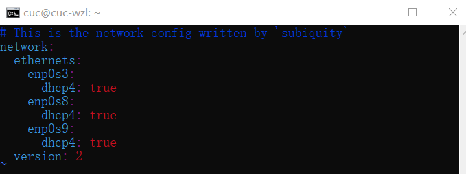

# 第一次试验记录

## 实验目的：无人值守安装过程以及问题解决（20.04版本）
***
## 实验问题：
1. 如何配置无人值守安装iso并在Virtualbox中完成自动化安装。
2. Virtualbox安装完Ubuntu之后新添加的网卡如何实现系统开机自动启用和自动获取IP？
3. 如何使用sftp在虚拟机和宿主机之间传输文件？
***
## 试验过程记录：
## 一、手动安装ubentu
1. 在Ubuntu[官网](https://releases.ubuntu.com/focal/)上下载ubuntu-20.04.2-live-server-amd64.iso镜像。

2. 然后**对比官方文档的sha256文件**确认镜像无损毁。
   注：win10系统镜像哈希值验证：***Get-FileHash + 待检验文件绝对路径 + -Algorithm + HASH值类型 + |Format-List***
   校验发现hash值一样，说明镜像无损，可以放心使用。
   
   
3. 新建虚拟机并且配置好双网卡
   
   
4. 导入盘片手动安装虚拟机成功

5. 使用 `ip a` 查看当前网卡情况和ip地址
   
   通过cmd窗口打开ssh客户端，在宿主机使用ssh服务连接到虚拟机
   
## 二、使用手动安装 Ubuntu 后得到的一个初始「自动配置描述文件」并对照[Ubuntu 20.04 + Autoinstall + VirtualBox](https://gist.github.com/bitsandbooks/6e73ec61a44d9e17e1c21b3b8a0a9d4c)中提供的示例配置文件酌情修改。
1. `sudo cat /var/log/installer/autoinstall-user-data`
   可以查看到如下文件：
   
   更改文件权限。
   
   使用`scp`命令把文件拷贝到本地，**切换到宿主机的目标文件夹中**，然后在主机终端输入：
   `scp cuc@192.168.56.102:/var/log/installer/autoinstall-user-data ./`
   如下图拷贝成功：
   
2. 酌情修改
+ **将autoinstall-user-data与[对比文件](https://gist.github.com/bitsandbooks/6e73ec61a44d9e17e1c21b3b8a0a9d4c)中的内容进行对比发现：**
   + `apt`、`identity`、`keyboard`在[对比文件](https://gist.github.com/bitsandbooks/6e73ec61a44d9e17e1c21b3b8a0a9d4c)中不存在。
   + 对比文件有,而autoinstall-user-data没有
  
   + 两个文件中的`network`形式不相同
   + 对比文件的`ssh`中`allow-pw:no`，而autoinstall-user-data中为`allow-pw: true`。
 + **再次和老师提供的[user-data](https://github.com/c4pr1c3/LinuxSysAdmin/blob/master/exp/chap0x01/cd-rom/nocloud/user-data)进行对比**
## 下面是我生成的**user-data**
```
#cloud-config
autoinstall:
  apt:
    geoip: true
    preserve_sources_list: false
    primary:
    - arches: [amd64, i386]
      uri: http://cn.archive.ubuntu.com/ubuntu
    - arches: [default]
      uri: http://ports.ubuntu.com/ubuntu-ports
  identity: {hostname: cuc-wzl, password: $6$pSON8oiyszoHxS3Z$qNQNv1mXFKa7.FVnW7rF6bmuD7jnHycE8V2MFpRbQYRcwOBsF3ISDCzc3wWqKzSa4I6jf85fNXl7xEb7TV3Cm1,
    realname: cuc, username: cuc}
  keyboard: {layout: us, toggle: null, variant: ''}
  timezone: Asia/Shanghai
  locale: en_US.UTF-8
  network:
    ethernets:
      enp0s3: {dhcp4: true}
      enp0s8: {dhcp4: true}
    version: 2
  ssh:
    allow-pw: true
    authorized-keys: []
    install-server: true
  storage:
    config:
    - {ptable: gpt, path: /dev/sda, wipe: superblock,
      preserve: false, name: '', grub_device: true, type: disk, id: disk-sda}
    - {device: disk-sda, size: 1MB, flag: bios_grub, number: 1, preserve: false,
      grub_device: false, type: partition, id: partition-0}
    - {device: disk-sda, size: 1GB, wipe: superblock, flag: '', number: 2,
      preserve: false, grub_device: false, type: partition, id: partition-1}
    - {fstype: ext4, volume: partition-1, preserve: false, type: format, id: format-0}
    - {device: disk-sda, size: -1, wipe: superblock, flag: '', number: 3,
      preserve: false, grub_device: false, type: partition, id: partition-2}
    - name: ubuntu-vg
      devices: [partition-2]
      preserve: false
      type: lvm_volgroup
      id: lvm_volgroup-0
    - {name: ubuntu-lv, volgroup: lvm_volgroup-0, size: -1, preserve: false,
      type: lvm_partition, id: lvm_partition-0}
    - {fstype: ext4, volume: lvm_partition-0, preserve: false, type: format, id: format-1}
    - {device: format-1, path: /, type: mount, id: mount-1}
    - {device: format-0, path: /boot, type: mount, id: mount-0}
  version: 1
  ```
## 三、参考番外章节Cloud-Init实验目录中的说明文件 ，制作包含 user-data 和 meta-data 的 ISO 镜像文件，假设命名为 focal-init.iso 
1. 将user-data文件传输到虚拟机中
   先在虚拟机中`mkdir focal-init`
   然后在宿主机中`scp C:\Users\Lenovo\Desktop\user-data cuc@192.168.56.102:/home/cuc/focal-init`将user-data文件传输到虚拟机中。
2. 在虚拟机中新建mate-data文件。
3. 生成ISO镜像文件，命名为focal-init.iso。
   `genisoimage -output focal-init.iso -volid cidata -joliet -rock user-data meta-data`
4. 移除虚拟机`「设置」-「存储」-「控制器：IDE」`
   在「控制器：SATA」下新建 2 个虚拟光盘，按顺序 先挂载「ubuntu-20.04.2-live-server-amd64.iso镜像文件」后挂载「focal-init.iso镜像文件」
   
5. 启动虚拟机，稍等片刻会看到命令行中出现以下提示信息。此时，需要输入 `yes`并按下回车键，剩下的就交给「无人值守安装」程序自动完成系统安装和重启进入系统可用状态了.
   
***
## 四、Virtualbox安装完Ubuntu之后新添加的网卡如何实现系统开机自动启用和自动获取IP。
### 操作步骤：
1. 在虚拟机关闭的状态下新添加一块网卡，并设置成host-only模式
2. 通过命令`ifconfig -a`可以看到**所有的网卡**
   
   通过命令`ifconfig`可以看到**工作的网卡**
   
   **发现新添加的网卡没有自动启用也没有自动获取ip**
3. 使用vim打开文件`sudo vim /etc/netplan/00-installer-config.yaml`
   
   英文状态下按下`i`键进入“插入模式”，插入
   ```
   enp0s9:
     dhcp4:true
   ```
   如下图：
   
   然后按`esc`键退出“插入模式”，回到“命令模式”，在“命令模式”下，输入英文状态的`:`进入“底行模式”，输入`wq`保存并退出。
4. 最后执行`sudo netplan apply`生效。
5. 重启以后发现新添加的网卡**能实现系统开机自动启用和自动获取IP**（enp0s9自动启用并且自动获取了ip：192.168.56.104）。
   
***
## 五、使用sftp在虚拟机和宿主机之间传输文件。
### 操作步骤：
1. 建立连接
   `sftp username@remote ip(or remote host name)`
   例如：`sftp cuc@192.168.56.102`
2. 上传命令
   `put /filepath/filename(localhost)   /filepath/filename(remote)`
3. 下载命令
   `get /filepath/filename(remote)   /filepath/filename(localhost)`
***
## 遇到的问题以及解决办法：
1. 使用`scp`命令进行文件传输时时出现问题。最开始没有切换到宿主机，再后来没有切换进目标文件，导致拷贝地址错误，出了几次错误才搞清楚具体怎么写。
   具体见下图：
   
2. 看了同学们在语雀上的提问和老师的解答，有关于实验过程的问题有许多和我遇到的重复，在[语雀课堂](https://www.yuque.com/c4pr1c3/linux)得到了解答。
3. 提交过程中出现了很多问题：（1）刚开始没有新建master直接提交到分支导致不成功（2）后来由于图片路径填写错误，多加了一个`/`，导致图片显示不出来，关掉了pr重新提交了一次。把分支克隆到本地的命令为`git clone -b 分支名 http://(git@github.comXXXX.git)`。
***
## 参考链接
+ [老师的课件](https://c4pr1c3.github.io/LinuxSysAdmin/chap0x01.exp.md.html#/-iso)
+ [语雀课堂提问](https://www.yuque.com/c4pr1c3/linux)
+ [Markdown语法](https://blog.csdn.net/u014061630/article/details/81359144)
+ [ubuntu20添加新网卡后设置自动启用并获取ip](https://blog.csdn.net/xiongyangg/article/details/110206220)
+ [sftp使用教程](https://jingyan.baidu.com/article/d169e1862366a7436611d895.html)