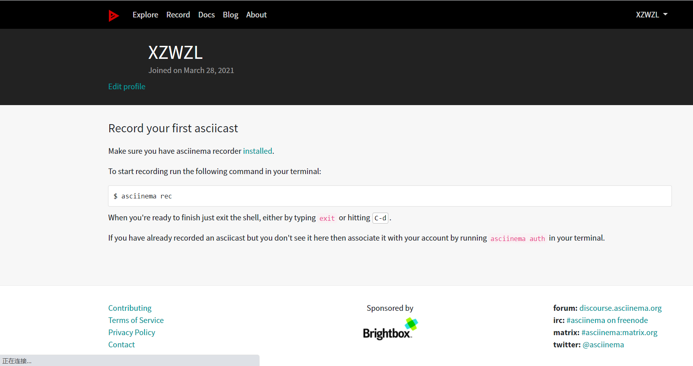

## 第二次实验
### 学习vimtutor操作并使用asciinema录屏
***
## 实验环境
#### 虚拟机；Virtualbox Ubuntu 20.04 Server 64bit
#### 环境：asciinema，vimtutor
***
## 实验要求
1. 根据vimtutor操作手册完成操作并使用asciinema进行录屏
2. 完成自查清单
***
## 实验步骤
### 1、注册asciinema账号,并在本地安装配置好asciinema
```
sudo apt-add-repository ppa:zanchey/asciinema
sudo apt-get update
sudo apt-get install asciinema
```


#### 在网页上登陆账号,在终端执行`asciinema auth`

#### 在`https://asciinema.org/connect/ba468b9b-d581-4a02-8401-a33884f872bb`可查看自己录制的视频
### 2、使用asciinema开始录屏，进入vimtutor学习相应操作，每一至两小节结束一次录制。
[asciinema-lesson1.1-1.2](https://asciinema.org/a/jgSPcAoJsO4H6i73s2fopRbZy)
[asciinema-lesson1.3-1.4](https://asciinema.org/a/XGCz5cJ7c4XGL2lnsil8siG4r)
[asciinema-lesson1.5-1.6](https://asciinema.org/a/5PZJpMSteLxd3YhZcND5y3lMH)
[asciinema-lesson2.1-2.2](https://asciinema.org/a/I02vQkqfvJSmT9mRMBhLzsaA6)
[asciinema-lesson2.3-2.4](https://asciinema.org/a/qYEe255TgBsppBu01Tzvwdotk)
[asciinema-lesson2.5-2.6](https://asciinema.org/a/Zqr11FYyxrsJgRJC3ms5fZVA5)
[asciinema-lesson2.7](https://asciinema.org/a/jbFXmgFG5CvM8MJ9UhbuCQdZK)
[asciinema-lesson3.1-3.2](https://asciinema.org/a/pcd0nGgraNdTBEXTCnBc63BM2)
[asciinema-lesson3.3-3.4](https://asciinema.org/a/LxoCnPQwV0rF6Qjiiwhmd1dlU)
[asciinema-lesson4.1](https://asciinema.org/a/fT3rY200uv0pF0DCjEUTwramf)
[asciinema-lesson4.2](https://asciinema.org/a/JkYa4vDrGL0Jd7tP6ryMI2HPD)
[asciinema-lesson4.3-4.4](https://asciinema.org/a/40aKh81hsmw4PHWtRYM1JxuJE)
[asciinema-lesson5.1-5.4](https://asciinema.org/a/Y7HluIFXIZhtQD2GxgBGitE2V)
[asciinema-lesson6.1](https://asciinema.org/a/U3SG2pmWwKBkCkt3eVRlHAvrb)
[asciinema-lesson6.2](https://asciinema.org/a/J06xMinRm19acF71wOEwyet8k)
[asciinema-lesson6.3-6.4](https://asciinema.org/a/NZV1JPRqIPHuDpWSjdkzPJMIw)
[asciinema-lesson6.5](https://asciinema.org/a/kKo44fTSuMqaa4ae53bkEgreL)
[asciinema-lesson7.1-7.3](https://asciinema.org/a/aLq7qHsiN9tljgNQgoVzVSBMm)
### 3、问题自查
1. 你了解vim有哪几种工作模式？
   命令模式，插入模式，底行模式
2. Normal模式下，从当前行开始，一次向下移动光标10行的操作方法？如何快速移动到文件开始行和结束行？如何快速跳转到文件中的第N行？
   ```
   10j#一次向下移动光标10行
   gg#快速移动到文件开始行
   G#快速移动到文件结束行
   NG#快速跳转到文件中的第N行
   ```
3. Normal模式下，如何删除单个字符、单个单词、从当前光标位置一直删除到行尾、单行、当前行开始向下数N行？
   ```
   x#字符
   dw#单词
   d$#行尾
   dd#单行
   Ndd#向下数N行
   ```
4. 如何在vim中快速插入N个空行？如何在vim中快速输入80个-？
   ```
   No #前插N个空行
   NO #后插N个空行
   80i/a- #在vim中快速输入80个-
   ```
5. 如何撤销最近一次编辑操作？如何重做最近一次被撤销的操作？
   `u  CTRL-R`
6. vim中如何实现剪切粘贴单个字符？单个单词？单行？如何实现相似的复制粘贴操作呢？
   ```
   v#选中
   $#选中当前行
   d#剪切
   p#粘贴
   v#选中
   $#选中当前行
   y#复制
   p#粘贴
   ```
7. 为了编辑一段文本你能想到哪几种操作方式（按键序列）？
   ```
   a i o #插入
   u #撤销最近一次操作
   CTRL-R #重做最后一次被撤销的操作
   y #复制
   p #粘贴
   r #替换
   d #剪切
   x dd dw d$ #删除操作
   :w #保存刚才的更改
   :q! #退出当前文件并且不保存一切修改
   :wq!#退出当前文件并保存一切修改
   ```
8. 查看当前正在编辑的文件名的方法？查看当前光标所在行的行号的方法？
   `:f/:e #文件名   CTRL-g #行号`
9.  在文件中进行关键词搜索你会哪些方法？如何设置忽略大小写的情况下进行匹配搜索？如何将匹配的搜索结果进行高亮显示？如何对匹配到的关键词进行批量替换？
     ```
    /or? #关键词
    ：set ic #忽略大小写
    set hls #显示高亮
    % s/xxx/yyy/g #批量替换
    ``` 
10. 在文件中最近编辑过的位置来回快速跳转的方法？
    `CTRL-O #向前跳转`和`CTRL-I #向后跳转`
11. 如何把光标定位到各种括号的匹配项？例如：找到(, [, or {对应匹配的),], or }
    光标移到括号下面然后输入`%`
12. 在不退出vim的情况下执行一个外部程序的方法？
    `:!<command>`
13. 如何使用vim的内置帮助系统来查询一个内置默认快捷键的使用方法？如何在两个不同的分屏窗口中移动光标？
    ```
    :help <shortcut> #默认快捷键
    ```
    在不同的分屏窗口移动光标，通过` :set mouse=a `开启vim鼠标支持模式，然后就可以移动光标了
    


