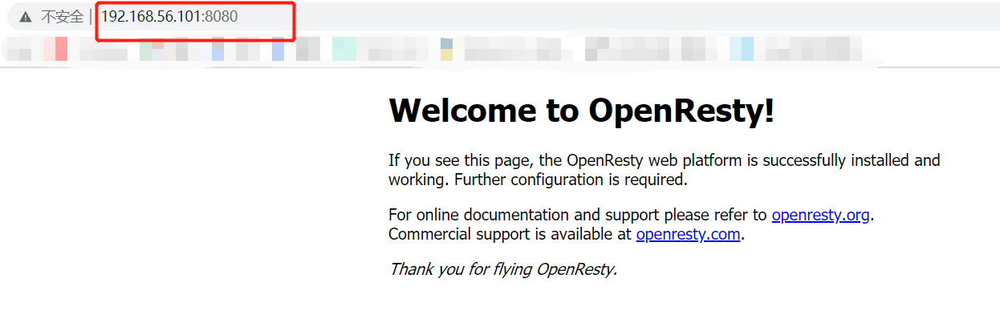
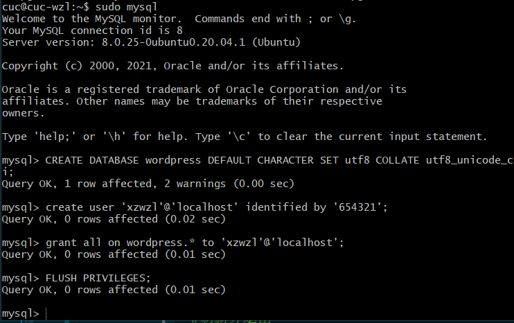
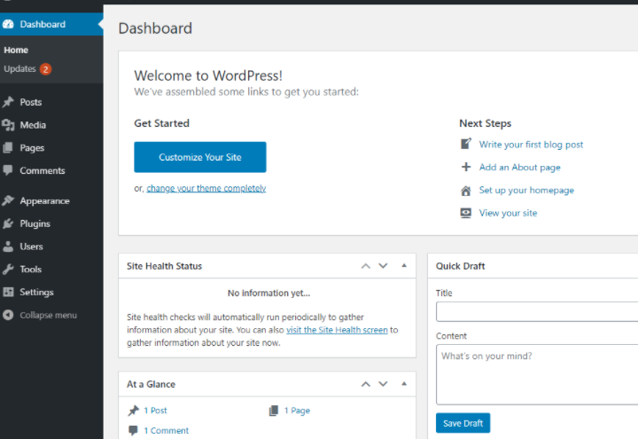

- [实验5 Web 服务器的搭建](#实验5-web-服务器的搭建)
  - [实验环境](#实验环境)
  - [实验配置](#实验配置)
    - [更改Windows主机hosts文件](#更改windows主机hosts文件)
    - [安装配置Verynginx、Nginx、Wordpress、DVWA](#安装配置verynginxnginxwordpressdvwa)
      - [Nginx](#nginx)
      - [VeryNginx](#verynginx)
      - [Wordpress](#wordpress)
      - [DVWA](#dvwa)
  - [参考链接](#参考链接)
  - [实验过程遇到的问题和解决办法](#实验过程遇到的问题和解决办法)

---

# 实验5 Web 服务器的搭建

## 实验环境

- 主机: Windows 10
- 虚拟机：Ubuntu-20.04.2-Server 64bit
- Nginx
- Verynginx
## 实验配置
### 更改Windows主机hosts文件
```bash
# Web Server
192.168.56.101 vn.sec.cuc.edu.cn
192.168.56.101 dvwa.sec.cuc.edu.cn
192.168.56.101 wp.sec.cuc.edu.cn
```

### 安装配置Verynginx、Nginx、Wordpress、DVWA
#### Nginx
- 安装nginx
  ```bash
  sudo apt update && sudo apt install nginx
  ```
- 安装mysql数据库

  ```bash
  sudo apt install mysql-server
  ```

- 安装php及相关组件

  ```bash
  sudo apt install php-fpm php-mysql php-curl php-gd php-intl php-mbstring php-soap php-xml php-xmlrpc php-zip
  ```

- 在主机访问80端口发现可以访问Nginx初始页面。
  
  

---

#### VeryNginx
- 首先克隆verynginx的仓库至虚拟机中，然后进入仓库目录，运行安装语句。

  ```bash
  # 克隆VeryNginx仓库
  git clone https://github.com/alexazhou/VeryNginx.git
  cd VeryNginx

  # 安装一些库和依赖
  sudo apt-get update && sudo apt-get install  build-essential

  # 缺少zlib库
  sudo apt-get update && sudo apt-get install zlib1g-dev

  # 缺少pcre库
  sudo apt-get update && sudo apt-get install libpcre3 libpcre3-dev 

  #缺少 libssl库
  sudo apt update && sudo apt install libssl-dev

  # 这里需要提权，以及注意python3
  sudo python3 install.py install
 
  ```

  

- 修改 `/opt/verynginx/openresty/nginx/conf/nginx.conf` 配置文件

  ```bash
  sudo vim /opt/verynginx/openresty/nginx/conf/nginx.conf

  #需要修改的：

  # 将user从nginx修改为www-data
  # 用户名
  user  www-data;

  # 监听端口
  # 这里设置为80端口，稍后修改nginx服务的端口
  server {
        listen 192.168.56.101:8080;
        
        #this line shoud be include in every server block
        include /opt/verynginx/verynginx/nginx_conf/in_server_block.conf;

        location = / {
            root   html;
            index  index.html index.htm;
        }
    }

  # 保存退出
  ```
- 完成安装工作以后，可以通过以下命令来运行 VeryNginx
  ```bash
  #启动服务
  /opt/verynginx/openresty/nginx/sbin/nginx

  #停止服务
  /opt/verynginx/openresty/nginx/sbin/nginx -s stop

  #重启服务
  /opt/verynginx/openresty/nginx/sbin/nginx -s reload
  ```

- 在主机访问8080端口发现可以访问Nginx初始页面。
  
  

- 启动verynginx，通过浏览器对verynginx进行配置，在浏览器中访问`http://vn.sec.cuc.edu.cn:8080/verynginx/index.html` 默认用户名和密码是 `verynginx` / `verynginx`。登录后就可以进行相关配置。
  
  

---

#### Wordpress

- 首先下载wordpress4.7安装包到 ubuntu18.04

  ```bash
  # 下载安装包
  sudo wget https://wordpress.org/wordpress-4.7.zip
  
  # 解压，unzip需要提前安装 
  sudo apt install unzip
  unzip wordpress-4.7.zip.1 #加了.1的原因见最下方“实验过程遇到的问题和解决办法”
  
  # 将解压后的wordpress移到指定路径
  sudo mkdir /var/www/html/wp.sec.cuc.edu.cn
  sudo cp -r wordpress /var/www/html/wp.sec.cuc.edu.cn
  
  #现在wordpress的本体已经放到了指定目录了，但是想要正常工作需要给它更高的权限
  sudo chown -R root:www-data /var/www/html/wp.sec.cuc.edu.cn/wordpress
  ```
  
  
- 在MySQL中新建一个数据库用于wordpress

  ```bash
  # 下载安装mysql数据库
  sudo apt install mysql-server
  # 登录
  sudo mysql
  ```
  ```sql
  # 新建一个数据库wordpress
  CREATE DATABASE wordpress DEFAULT CHARACTER SET utf8 COLLATE utf8_unicode_ci;
  
  # 新建一个用户
  create user 'xzwzl'@'localhost' identified by 'password';

  # 授权
  grant all on wordpress.* to 'xzwzl'@'localhost';

  #刷新并退出
  FLUSH PRIVILEGES;
  EXIT;
  ```

  

  ```bash
  # 将wp-config-sample中的内容修改，然后改名为wp-config
  sudo vim wp-config-sample.php#注意路径
  sudo mv wp-config-sample.php wp-config.php
  ```

  

- 重启php-fpm

  ```bash
  # 重启php-fpm
  sudo systemctl restart php7.4-fpm
  ```
  在重启php-fpm的时候遇到问题：

  

  检查之后发现它监听的是 php7.4-fpm , 所以只需重启这个就行

  

- 配置nginx

  ```bash
  # 修改nginx配置 
  sudo vim /etc/nginx/sites-enabled/default
  
  # 将网站根站点修改为wordpress的安装目录 并保存退出
  root /var/www/html/wp.sec.cuc.edu.cn;
  ```

  
  
  
  然后用`sudo nginx -t`检查语法无误。

  

  重启一下nginx服务：`sudo systemctl reload nginx`
- 浏览器输入IP加上/wp-admin/即可，登入后即可进入网站后台。
  

  


- 配置PHP-FPM进程的反向代理
  - 配置Nginx服务器块文件
   
    - 创建新服务器块配置文件
      ```bash
      sudo vim /etc/nginx/sites-available/wp.sec.cuc.edu.cn
      ```
    - 写入：
      ```bash
      server {
          listen 80 default_server;
          listen [::]:80 default_server;

          root /var/www/html/wp.sec.cuc.edu.cn;
          index index.php index.html index.htm index.nginx-debian.html;
          server_name wp.sec.cuc.edu.cn;

          location / {
              # try_files $uri $uri/ =404;
              try_files $uri $uri/ /index.php$is_args$args;
      
          }

          # 配置PHP-FPM进程的反向代理配置在nginx服务器上    
          location ~ \.php$ {
              include snippets/fastcgi-php.conf;
              fastcgi_pass unix:/var/run/php/php7.2-fpm.sock;
          }

          location ~ /\.ht {
              deny all;
          }
      }
      ```
      
  - 创建从新服务器块配置文件到/etc/nginx/sites-enabled/目录的符号链接
    ```bash
    sudo ln -s /etc/nginx/sites-available/wp.sec.cuc.edu.cn /etc/nginx/sites-enabled/
    ```
  - 取消链接默认配置文件
    ```bash
    sudo unlink /etc/nginx/sites-enabled/default
    ```
  - 测试并重启nginx
    ```bash
    sudo nginx -t
    sudo systemctl reload nginx
    ```
#### DVWA

- 下载安装
    ```bash
    #将DVWA源码clone到可写目录
    sudo git clone https://github.com/ethicalhack3r/DVWA /tmp/DVWA
    #拷贝至/var/www/html
    sudo mkdir /var/www/html/dvwa.sec.cuc.edu.cn
    sudo cp -r /tmp/DVWA/. /var/www/html/dvwa.sec.cuc.edu.cn
    ```

- 创建数据库和供DVWA使用的用户
    ```bash
    #登录MySQL
    sudo mysql

    #为dvwa创建MySQL数据库
    CREATE DATABASE dvwa DEFAULT CHARACTER SET utf8 COLLATE utf8_unicode_ci;
    GRANT ALL ON  dvwa.* TO 'wzl'@'localhost' IDENTIFIED BY 'password2';
    FLUSH PRIVILEGES;
    exit;
    ```
- 设置DVWA与PHP等相关环境
    ```bash
    # 重命名
    cd /var/www/html/dvwa.sec.cuc.edu.cn/config/
    sudo cp config.inc.php.dist config.inc.php

    # 修改配置
    sudo vim /var/www/html/DVWA/config/config.inc.php
    ## 根据数据库对应修改配置
    $_DVWA[ 'db_database' ] = 'dvwa';
    $_DVWA[ 'db_user' ]     = 'wzl';
    $_DVWA[ 'db_password' ] = 'password2';
    ##

    # 修改php配置
    sudo vim /etc/php/7.2/fpm/php.ini 
    
    ## 设置以下内容
    allow_url_include = on
    allow_url_fopen = on
    safe_mode = off
    magic_quotes_gpc = off
    display_errors = off
    ##

    #重启php
    sudo systemctl restart php7.2-fpm
    #将所有权分配给www-data用户和组
    sudo chown -R www-data.www-data /var/www/html/dvwa.sec.cuc.edu.cn
    ```
 
- 创建新服务器块配置文件
    ```bash
    sudo vim /etc/nginx/sites-available/dvwa.sec.cuc.edu.cn
    ```
- 写入：
    ```bash
    server {
        listen 8080 default_server;
        listen [::]:8080 default_server;

        root /var/www/html/dvwa.sec.cuc.edu.cn;
        index index.php index.html index.htm index.nginx-debian.html;
        server_name dvwa.sec.cuc.edu.cn;

        location / {
            #try_files $uri $uri/ =404;
            try_files $uri $uri/ /index.php$is_args$args;  
        }
  
        location ~ \.php$ {
            include snippets/fastcgi-php.conf;
            fastcgi_pass unix:/var/run/php/php7.2-fpm.sock;
        }

        location ~ /\.ht {
            deny all;
        }
    }
    ```
    
- 创建从新服务器块配置文件到/etc/nginx/sites-enabled/目录的符号链接
    ```bash
    sudo ln -s /etc/nginx/sites-available/dvwa.sec.cuc.edu.cn /etc/nginx/sites-enabled/
    ```

- 测试并重启Nginx服务
    ```bash
    sudo nginx -t
    sudo systemctl reload nginx
    ```


- 通过8080端口访问`dvwa.sec.cuc.edu.cn`，生成需要使用的数据库

    在登录页面输入默认账号密码：
    ```
    User: admin
    Password: password
    ```


​ 
## 参考链接
- [alexazhou/VeryNginx官方文档](https://github.com/alexazhou/VeryNginx)
- [第五章课件](https://c4pr1c3.github.io/LinuxSysAdmin/chap0x05.exp.md.html#/title-slide)
- [B站视频](https://b23.tv/EsqOrH)
- [CSDN虚拟机UbuntuServer20.04配置LNMP并安装Wordpress个人博客](https://blog.csdn.net/NCEPUautomation/article/details/112221221)
- [How To Install Linux, Nginx, MySQL, PHP (LEMP stack) on Ubuntu 20.04](https://www.digitalocean.com/community/tutorials/how-to-install-linux-nginx-mysql-php-lemp-stack-on-ubuntu-20-04)

## 实验过程遇到的问题和解决办法

- 最开头的目录是借鉴师哥的写法，又发现了一种不错的新写法。
- VeryNginx安装配置过程在`sudo python3 install.py install`这一步各种出错。参考[官方文档中的故障排查](https://github.com/alexazhou/VeryNginx/wiki/Trouble-Shooting)，在`libssl-dev`的安装一直不成功，不能完全照着文档的代码和老师的视频来，我最后成功的代码是`sudo apt update && sudo apt install libssl-dev`。终于` All work finished successfully, enjoy it~`了。
- 出现安装错了的问题再重新安装各种库真的好浪费时间，所以一定要勤备份。
- 运行 VeryNginx 的时候启动服务一直失败，要使用`sudo`。
  
  

- 由于在下载wordpress4.7安装包时候中止了一次，所以下载下来的是（如下图），所以在解压时候的命令要改成`unzip wordpress-4.7.zip.1`
  
  

- 在Linux系统中使用cp命令对文件夹或者目录进行复制操作时，有时候会出现cp:omitting directiory的错误提示,解决办法是：在`cp`命令后，加一个选项 `-r`。
  
  
